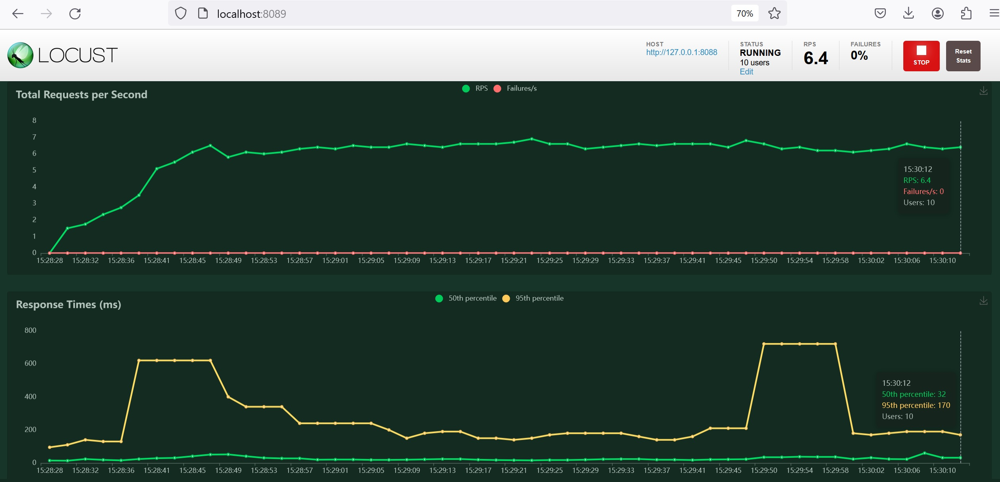
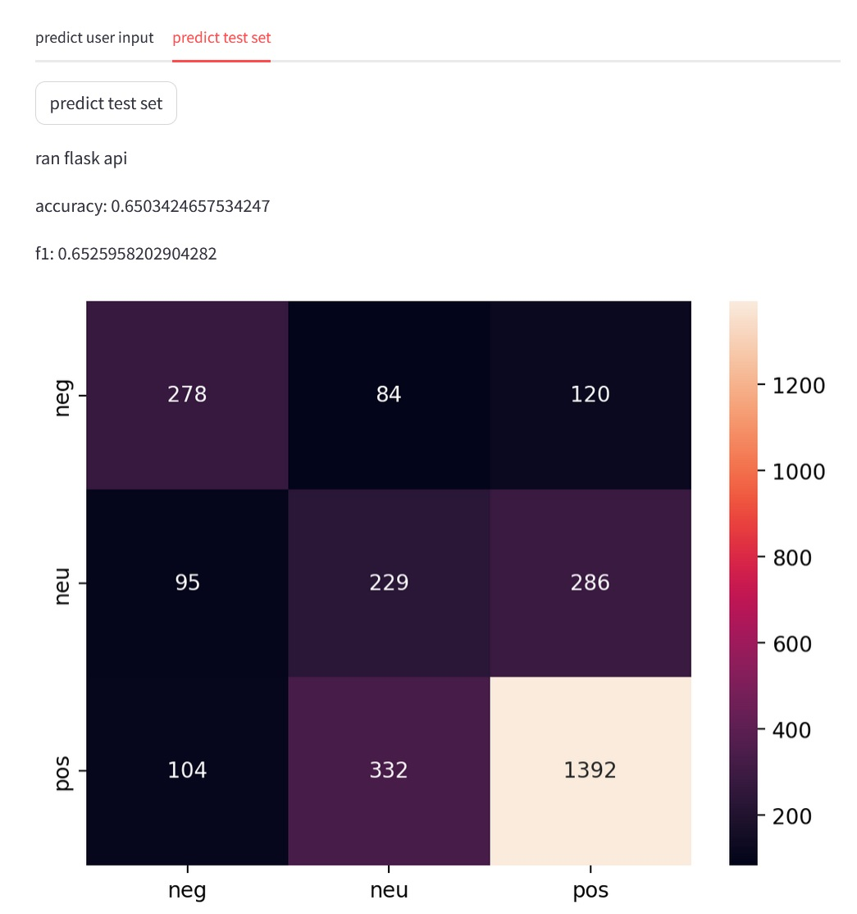
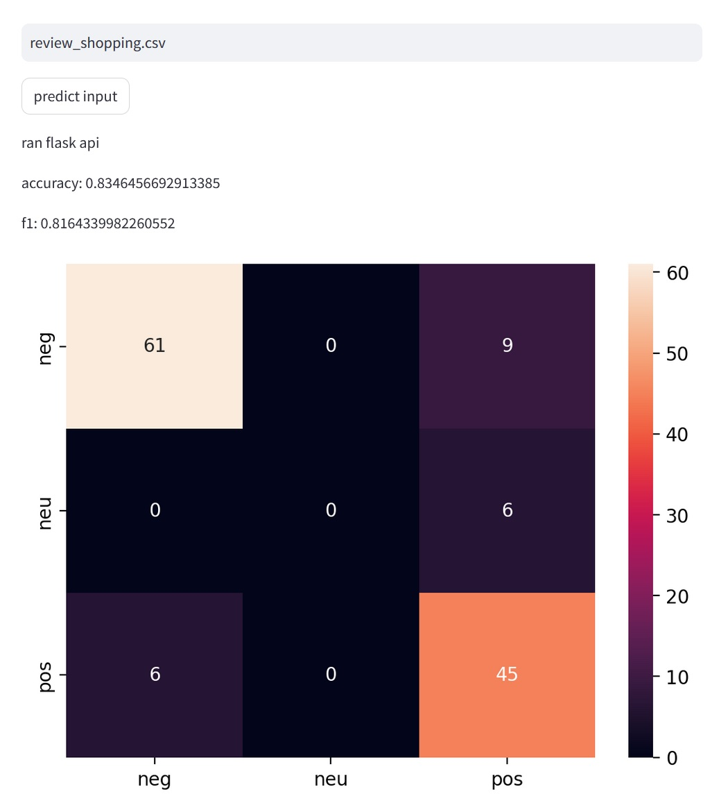

# sentiment_analysis_test

### Highlights
- 83.5% accuracy on test set (from totally different source from train and val)
- 65.3% accuracy on validation set
- API can handle ~6 concurrent users in under 0.2 seconds.

### Disclaimer

- The goal of this repository is not to achieve SOTA or even decent sentiment analysis performance.
  - Rather, the main goal is to build working and reusable components.
    - The components were aimed be reusable in other NLP tasks, not just Sentiment Analysis.
- In the google scraping, google search goes by relevance according to google's algorithm and sometimes search results may not be restricted to what the search terms intend. Double-checking of relevance is beyond the scope of this repository.
- I decided I didn't have enough time for any hyperparameter tuning.


### Compatibilities

- Any review prompt and any csv data with 1-2 columns may be used as test data through the Streamlit interface.
  - The first column is required to be review text.
  - The second column (if any) is for labels with values 0-1-2
    - 0 for negative, 1 for neutral, and 2 for positive.
  - The column names of the csv are overwritten and thus does not need to match.
- Streamlit interface and LSTM training modules have conflicting requirement.
  - protobuf version required is 3.19.6 for Tensorflow 2.10.1, but is 4.25 for Streamlit.
  - It is therefore recommended to use separate Environments or reinstall protobuf as needed.
- All development was done on Windows 10 with CUDA GPU.
  - While Flask docker deployment should be compatible across platforms, the rest of the code may not.
- Other datasets that conform to the same format can be used for training
  - The data is required to contain ```['review', 'rating', 'type'>]``` features
    - Review is any free text review, which should be predominantly Thai.
    - Rating is from 1-5, which will be mapped to 0-2.
    - Type is what the code use to stratify train/test split.
      - This can be modified of course, but only by editing code.


### Requirements
- Requires Python 3.8, at least for Tensorflow training module on Windows.
  - This is because Tensorflow only support GPU acceleration up to 2.10
- Requirement files are splitted into 3 files for each of the main component
  - Web scraping
  - Model
  - Streamlit
- Requires Docker engine for Flask model service API.


## How to run


### Customization
- Adjust ```data_scrape/data_parameters.py```, ```parameters.py```, and ```.env``` as needed.
- ```FLASK_PORT``` in ```.env``` is the port specified to be used by Flask application, and must be vacant.


### Web Scraping Module
- ```python scrape_data.py``` to run with default parameters. Spawns 4 threads by default. Requires Chrome. May or may not work with your language and locality settings. Preferably set both to Thai.


### Model Module
- ```python sklearn_module.py``` to train Naive-Bayes and Linear Regression on TF-IDF data with default parameters.
- ```python lstm_module.py``` to train Tensorflow LSTM model with default parameters.
- Models and vectorizers will be created in project directory. Copy these to ```models``` folder for them to be used by Flask app.


### Flask API Module
1. ```sh export_library.sh``` to build library from ```src``` and copy wheel to ```dockerfile``` folder.
2. ```sh prepare_demo.sh``` to build docker image create running container for Flask model service API.
3. ```streamlit run streamlit_interface.py``` to run Streamlit web interface to call model API.
4. Close Streamlit and ```sh close_demo.sh``` when done testing to take down the docker container and image.


## Evaluation Metrics

### Locust load test


### Accuracy - F1 - Confusion Matrix on Validation set


### Accuracy - F1 - Confusion Matrix on Test set
Test set from [PyThaiNLP](https://github.com/PyThaiNLP/thai-sentiment-analysis-dataset/blob/master/review_shopping.csv). (Has to be preprocessed to change separator from ```\t``` to ```,```)


### Development log

2023-12-28, 10:30 - Created the repository.

2023-12-28, 15:00 - Added google map review scraping module.

2023-12-29, 15:40 - Added basic tokenization module and researched potential deep learning models to fine-tune

2023-12-30, 22:45 - Experimenting with basic LSTM. Downgraded required Python to 3.8 to enable GPU acceleration on Tensorflow. Have yet to re-test the web scraping module.

2023-12-31, 23:15 - Modularized the LSTM module and data preparation module. Devised my own text slicing data augmentation method. Experimented with tf-idf input method.

2024-01-01, 22:30 - Productionized the LSTM model with Flask app and Web interface for model call. Added Naive-Bayes and Linear Regression module.

2024-01-02, 16:00 - Retrained LSTM and wrapped up. Added Locust test.

### Development plan

1. Find some usable data for sentiment analysis in Thai
    - Google map reviews scraping ✓
2. Tokenization / Data Preparation
    - Group reviews by rating and map to 3 levels of sentiment ✓
    - <u>pythainlp</u> library for tokenization ✓
    - Data preprocessing ✓
    - Oversampling of minority classes ✓
    - Text slicing Data Augmentation ✓
3. Model
    - LSTM module ✓
    - Naive-Bayes ✓
    - Linear Regression ✓
    - Vote ✓
4. Evaluation
    - Accuracy ✓
    - F1 ✓
    - Confusion Matrix ✓
    - Locust test ✓
5. Wrap Up
    - Model Productionization via Flask app ✓
    - Web interface for model call ✓


### Potential Future Experiment
- Combine TF-IDF features with LSTM features.